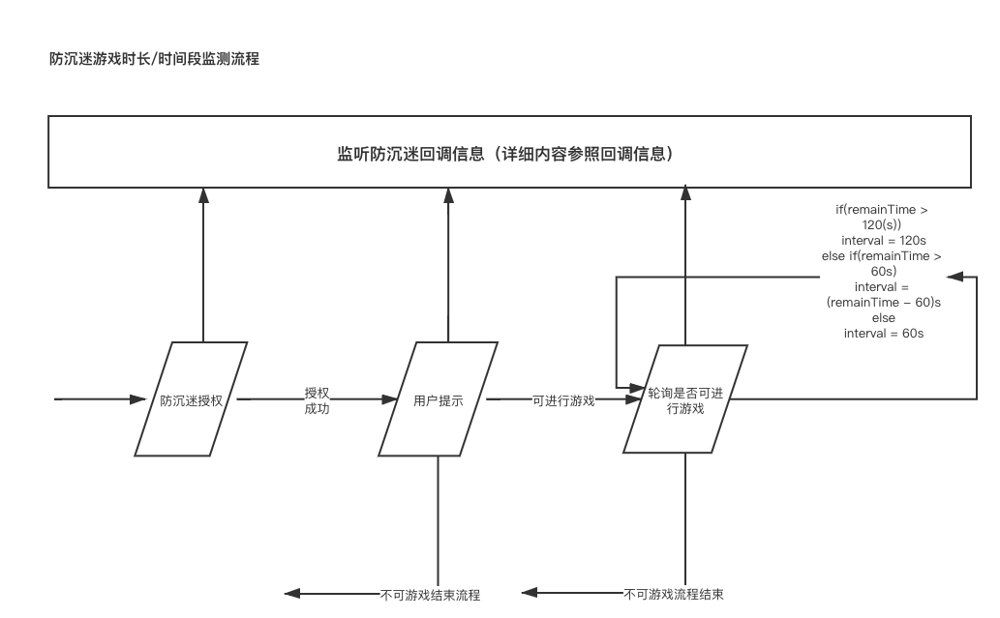

# 开源防沉迷
简介:为了应对最新防沉迷政策而编写的一个集实名登记、防沉迷时长限制、付费限制三部分功能的组件，方便国内游戏团队快速接入游戏实现防沉迷功能从而符合政策规定

## Android

### [Android 接入文档](./Android/AntiAddiction/README.md)

## iOS

### [iOS 接入文档](./iOS/antiaddictionservice-ios/README.md)

## Unity
### [Unity 接入文档](./Unity/AntiAddiction-Unity/README.md)

## Server 

### [防沉迷服务端 接入文档](./Server/anti-addiction-server/README.md)
### [实名认证服务端 接入文档](./Server/tds-registration-server/README.md)

## 防沉迷功能流程介绍
### 游戏时长/时间段控制流程图

## FAQ

